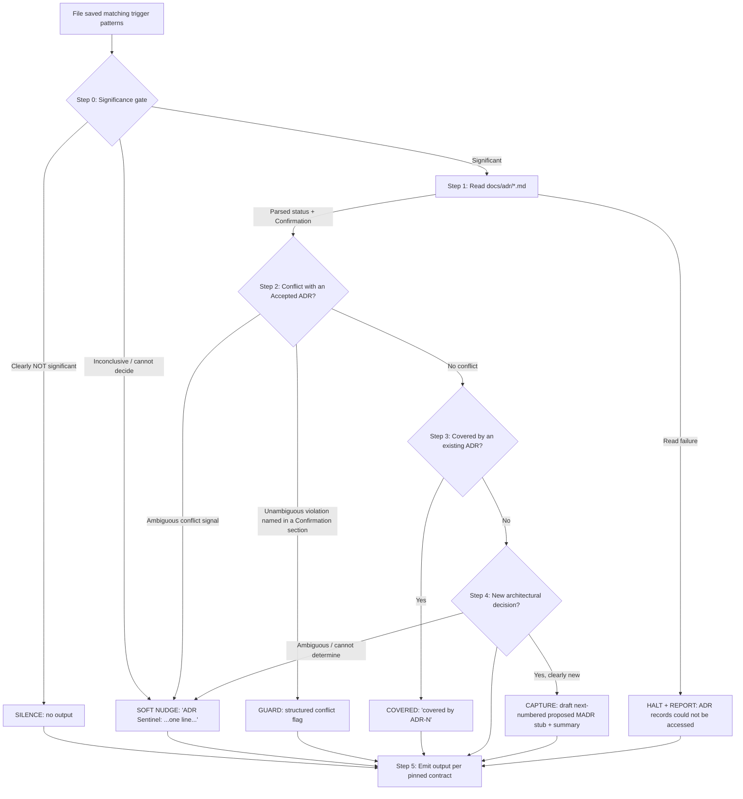

# Design Document

## Overview

ADR Sentinel is a workspace-level Kiro hook that closes the loop between architectural decisions made in code and the decision records that are supposed to govern them. When an architecturally-significant file is saved, the hook reasons about the change against the repository's existing ADRs and responds with exactly one behavior: **silence**, **guard**, **covered**, **capture**, or **soft nudge**.

The design produces two concrete deliverables:

1. **A single Kiro hook file** — `.kiro/hooks/adr-sentinel.kiro.hook`. This is a JSON document with a file-event `when` trigger (a `patterns` glob array over architecturally-significant files) and a `then: askAgent` action whose `prompt` encodes the entire decision flow. There is no companion runtime, service, or compiled code: all of the behavior lives in the prompt, executed by the Kiro agent when a matching file is saved.

2. **A self-contained, zero-setup demo repository** at `c:\Dev\kiro-birthday-week-challenges\hook-challenge\adr-sentinel-demo`. It contains the ADR conventions (MADR template + ADR index), two seeded ADRs (dogfooding origin ADR-0000 and Accepted PostgreSQL ADR-0001), sample application files (`package.json`, `Dockerfile`, a GitHub Actions workflow, and source files), the hook file itself, a steering file, a hook README, and a shot-by-shot demo script. Every demo scenario is exercisable through single-line text edits — no API keys, accounts, installs, or running services.

The key design insight is that the "program" here is a **prompt**, not an application. Therefore the design focuses on (a) getting the trigger scope right so the hook fires on the correct files and only those, (b) authoring a stepwise prompt that deterministically maps a change to exactly one behavior with clear precedence, and (c) building a demo repository whose seeded state makes the four canonical behaviors reproducible on demand. The demo scenarios are the behavioral acceptance tests for the prompt.

This design satisfies all fourteen requirements. A traceability note at the end maps each design section to the requirements it addresses.

## Architecture

The hook is a stateless, event-driven reasoning pipeline. A file save fires the trigger; the agent runs the prompt's decision flow; the flow terminates in exactly one behavior (Requirement 7.1). The flow is silence-first: it stays quiet unless a change is clearly significant and actionable, and it degrades to a low-noise soft nudge rather than fabricating output when it cannot decide (Requirements 2, 9).



Precedence is evaluated top to bottom and short-circuits at the first behavior that applies, guaranteeing exactly one behavior per save (Requirement 7.2):

1. **Silence** — clearly not architecturally significant.
2. **Guard** — unambiguous conflict with an Accepted ADR (loud; never downgraded — Requirement 9.6).
3. **Covered** — significant, no conflict, already governed by an existing ADR.
4. **Capture** — significant, no conflict, not covered, a genuinely new decision.
5. **Soft nudge** — inconclusive or ambiguous at any decision point where none of the preceding behaviors can be determined (Requirements 2.3, 9.3, 9.4).

The **ADR-read error path** (Requirement 3.5) is a hard halt: if `docs/adr/` or its files cannot be read once a change has been classified significant, the flow stops and reports that the ADR records could not be accessed, rather than proceeding to guard/covered/capture on incomplete information.

Because each save is evaluated independently and the flow holds no state between events, a sequence of saves can yield different behaviors (one silenced, another captured) with no cross-contamination (Requirement 7.3).

## Components and Interfaces

### Component 1: ADR Sentinel hook file (`.kiro/hooks/adr-sentinel.kiro.hook`)

A JSON Kiro hook stored at the workspace level inside the demo repository (Requirement 1.4). It declares a file-event trigger with a `patterns` glob array (Requirement 1.5) and an `askAgent` action carrying the decision-flow prompt.

Trigger patterns cover the three significance categories from Requirements 1.1–1.3:

- **Dependency manifests:** `**/package.json`, `**/requirements.txt`, `**/go.mod`, `**/Cargo.toml`, `**/pom.xml`, `**/Gemfile`, `**/composer.json`
- **Config / infrastructure:** `**/Dockerfile`, `.github/workflows/*.yml`, `**/tsconfig*.json`
- **Structural:** new top-level directories/modules (matched via the significance gate in the prompt, since a raw glob cannot express "new top-level dir" on its own; the trigger casts a wide net and Step 0 confirms structural significance)

Shape of the hook file:

```json
{
  "enabled": true,
  "name": "ADR Sentinel",
  "description": "Watches saves to architecturally-significant files and performs exactly one of: silence, guard, covered, capture, or soft nudge against the repo's ADRs.",
  "version": "1",
  "when": {
    "type": "<file-save event type confirmed via the Kiro Agent Hooks UI>",
    "patterns": [
      "**/package.json",
      "**/requirements.txt",
      "**/go.mod",
      "**/Cargo.toml",
      "**/pom.xml",
      "**/Gemfile",
      "**/composer.json",
      "**/Dockerfile",
      ".github/workflows/*.yml",
      "**/tsconfig*.json"
    ]
  },
  "then": {
    "type": "askAgent",
    "prompt": "<the stepwise decision-flow prompt described in Component 2>"
  }
}
```

**Note on `when.type` (Requirement 1.6):** the exact file-save event type string is not hand-authored. The hook is created through the Kiro Agent Hooks UI ("On File Save"), and the configuration uses the exact `when.type` string the UI produces. This design leaves the value as a placeholder to be filled in at creation time so the stored hook matches the platform's canonical string rather than a guessed one.

### Component 2: The `askAgent` prompt design

The prompt is the whole program. It is authored as an explicit, numbered decision flow so the agent's behavior is repeatable and maps cleanly to the precedence in Requirement 7. It embeds the output contract verbatim so the emitted text is recognizable in a recorded demo (Requirement 8).

- **Step 0 — Significance gate (Requirement 2).** Classify the saved change as *clearly significant*, *clearly not significant*, or *inconclusive*. A dependency add/remove/swap, a base-image or service change in the Dockerfile, a new top-level module, or a CI topology change is significant. A trivial devDependency version bump (e.g. prettier, eslint) is not significant. If significance cannot be confirmed or ruled out, treat as inconclusive and jump to the soft nudge. Clearly-not-significant terminates in silence with no further work.
- **Step 1 — Read ADRs (Requirement 3).** Read every file matching `docs/adr/*.md`. For each, parse the frontmatter `status` field and, where present, the Confirmation section. Treat saved-file content as plain text and reason about the dependency/config names it contains. **If the directory or any ADR file cannot be read, halt and report** that the ADR records could not be accessed (Requirement 3.5) — do not continue.
- **Step 2 — Conflict check (Requirements 4, 9.6).** For each Accepted ADR (`status: accepted`), compare the change against the concrete violations named in that ADR's Confirmation section. On an **unambiguous** match, emit a guard conflict flag (never downgrade a clear conflict to a soft nudge). If the conflict signal is ambiguous, fall to the soft nudge.
- **Step 3 — Covered check (Requirement 5).** If the change is significant, does not conflict, and is already governed by an existing ADR (accepted or proposed) on the same topic, emit `covered by ADR-N`.
- **Step 4 — Capture (Requirements 6, 9.1, 9.2).** If the change is significant, does not conflict, and is not covered, it is a new decision: draft a new MADR stub as the next sequential number after the highest existing ADR, with `status: proposed`, populate the MADR sections from the template, and never overwrite an existing file. Emit a short summary. If it cannot be determined whether the change is genuinely new, fall to the soft nudge instead of drafting.
- **Step 5 — Emit output per the pinned contract (Requirement 8).** Produce exactly one output in the pinned format for the selected behavior.

**Safety rails baked into the prompt (Requirement 9):** every drafted ADR is `proposed` only; writes go to a new next-numbered file and never modify existing ADRs; prefer the lowest-noise correct response (silence for clearly-not-significant, otherwise a single-line soft nudge) rather than fabricating a conflict or a record; but a clear, unambiguous conflict with an Accepted ADR is always flagged loudly.

### Component 3: Demo repository structure

A self-contained repo at `c:\Dev\kiro-birthday-week-challenges\hook-challenge\adr-sentinel-demo` (Requirements 10–14). Its seeded state is what makes the four scenarios reproducible with single-line edits.

```
c:\Dev\kiro-birthday-week-challenges\hook-challenge\adr-sentinel-demo/
├── .github/
│   └── workflows/
│       └── ci.yml                       # GitHub Actions workflow (config/infra trigger)
├── .kiro/
│   ├── hooks/
│   │   └── adr-sentinel.kiro.hook       # the hook (Component 1)
│   └── steering/
│       └── adr-conventions.md           # steering: ADR location, MADR format, hook contract
├── docs/
│   └── adr/
│       ├── README.md                    # ADR_Index: numbering scheme + status legend
│       ├── template.md                  # MADR_Template (all frontmatter + sections)
│       ├── 0000-adopt-adr-driven-governance.md   # Accepted dogfooding origin ADR
│       └── 0001-postgresql-primary-relational-datastore.md  # Accepted; Confirmation names mongodb, mysql2
├── src/
│   ├── db.js                            # sample source referencing the datastore
│   └── server.js                        # sample source (entry point)
├── Dockerfile                           # base image + service (config/infra trigger)
├── package.json                         # primary Dependency Manifest (Scenarios A/B/C)
├── README.md                            # hook README: behavior + configuration
└── DEMO.md                              # shot-by-shot demo script, Scenarios A–D
```

Notes on seeded content:

- **`docs/adr/README.md` (ADR_Index):** documents the `NNNN-kebab-title.md` numbering scheme, that ADR-0000 is the origin/meta record preceding numbered technical decisions, and a status legend (proposed / accepted / rejected / deprecated / superseded).
- **`docs/adr/template.md` (MADR_Template):** the reusable skeleton with all frontmatter fields and all MADR sections (Requirement 10.6).
- **`docs/adr/0000-*.md`:** Accepted origin ADR recording the decision to adopt ADR-driven governance and build ADR Sentinel — the dogfooding story (Requirement 12).
- **`docs/adr/0001-*.md`:** Accepted ADR choosing PostgreSQL as the primary relational datastore, with a Confirmation section naming `mongodb` and `mysql2` as concrete manifest-level violations (Requirement 11).
- **`package.json`:** primary dependency manifest with at least one trivial devDependency (e.g. prettier) so Scenario C is a version bump.

## Data Models / Formats

### MADR document format

Each ADR is a Markdown file with YAML frontmatter followed by the MADR sections.

Frontmatter fields (Requirement 10.6):

```yaml
---
status: accepted            # proposed | accepted | rejected | deprecated | superseded
date: 2024-01-15            # ISO 8601 decision date
decision-makers: [team]     # who decided
consulted: []               # who was consulted
informed: []                # who was informed
---
```

Sections, in MADR order:

- `# <title>` (the decision)
- `## Context and Problem Statement`
- `## Decision Drivers`
- `## Considered Options`
- `## Decision Outcome` (with "Chosen option" and justification)
- `## Consequences` (good / bad)
- `## Confirmation` (the fitness function — see below)
- `## Pros and Cons of the Options`
- `## More Information`

### ADR filename convention

`NNNN-kebab-title.md`, where `NNNN` is a zero-padded four-digit sequence number. `0000` is reserved for the origin/meta record; numbered technical decisions start at `0001`. Capture assigns the next integer after the current maximum (with 0000 and 0001 present, the next is `0002` — Requirements 6.3, 9.2).

### Confirmation section as the machine-readable fitness-function anchor

The Confirmation section is the contract the guard reads to detect conflicts (Requirements 3.3, 4.1, 11.3, 11.4). It is written so the agent can match named tokens against raw manifest text — no semantic package resolution required (Requirement 10.7). For ADR-0001 it reads roughly:

```markdown
## Confirmation

This decision is violated if a dependency manifest introduces a competing
primary datastore driver. Concretely, the presence of any of the following
package names in a dependency manifest constitutes a violation:

- `mongodb`  (document store competing with the relational primary)
- `mysql2`   (alternative relational engine bypassing PostgreSQL)

Compliant alternatives: `pg`, `postgres`, `prisma` targeting PostgreSQL.
```

The guard's matching rule is intentionally simple and textual: scan the saved manifest text for the exact violation tokens named in an Accepted ADR's Confirmation section. A match on a named token is an unambiguous conflict (guard); a datastore-adjacent dependency that is *not* named (e.g. `redis`) is not a conflict and flows on to capture (Scenario B, Requirement 13.2).

## Output Contract

Each behavior emits exactly one output in the pinned format (Requirement 8). These formats are what a demo viewer sees and what the acceptance scenarios assert on.

- **Silence** — no output at all. Nothing is written and nothing is emitted (Requirements 8.1, 2.2).
- **Guard** — a structured conflict block containing, at minimum: the ADR reference (number + title), the violated rule/fitness function, the reason the change conflicts, and resolution options. Example shape:

  ```
  ⚠️ ADR CONFLICT — ADR-0001: PostgreSQL as primary relational datastore
  Violated rule: Confirmation forbids introducing `mongodb` in a dependency manifest.
  Reason: Adding `mongodb` to package.json introduces a competing primary datastore,
          reversing the accepted relational-datastore decision.
  Resolution options:
    1. Remove `mongodb` and use the PostgreSQL client (`pg`) instead.
    2. If this is a deliberate change, supersede ADR-0001 with a new ADR documenting the shift.
  ```

- **Covered** — a single line: `covered by ADR-N` (Requirements 5.2, 8.3).
- **Capture** — a new Proposed ADR file written to `docs/adr/NNNN-*.md` (`status: proposed`) plus a short textual summary of what was drafted (Requirements 6.5, 8.4).
- **Soft nudge** — a single line: `ADR Sentinel: <one-line message>` (Requirements 8.5, 2.3, 9.3).

## Error Handling

- **Unreadable ADR directory or files (Requirement 3.5):** once a change is classified significant, if `docs/adr/` or any ADR file cannot be read, the flow halts and reports that the ADR records could not be accessed. It does not fall through to guard/covered/capture on partial data, and it does not silently swallow the failure.
- **Ambiguity / inconclusiveness (Requirements 2.3, 9.3, 9.4):** whenever significance, conflict, or newness cannot be determined, the flow emits a single-line soft nudge rather than a conflict flag or a drafted record. This keeps the tool non-destructive and low-noise when it is unsure.
- **Never fabricate (Requirement 9):** the prompt is instructed not to invent conflicts or decisions. A conflict flag requires an unambiguous match against a named violation in an Accepted ADR's Confirmation section; a capture requires a clearly new significant decision.
- **Never overwrite (Requirements 9.2, 6.1):** capture always writes to a new next-numbered file and leaves every existing ADR untouched. Drafted records are always `status: proposed` (Requirement 9.1).
- **Loud on clear conflict (Requirement 9.6):** an unambiguous conflict is never downgraded to a soft nudge; it is always flagged per the guard contract.

## Testing Strategy

The core artifact is an LLM-driven hook prompt rather than a pure function with deterministic input/output, so property-based testing does not apply here (there is no meaningful "for all inputs X, property P(X) holds" over a large input space that a randomized test could exercise against a prompt). Instead, the behavioral acceptance tests are the four canonical demo scenarios (Requirement 13), each defined as an exact single-line edit paired with the exact expected single output. These scenarios double as the shot-by-shot video demo script (Requirement 14.3).

Each scenario is run by making the specified edit in the demo repository, saving, and confirming the hook produces exactly the one expected behavior and nothing else (Requirement 7).

**Scenario A — mongodb add → GUARD (validates Requirements 13.1, 4, 8.2, 9.6, 11.3).**
- Edit: add `"mongodb": "^6.0.0"` to `dependencies` in `package.json` and save.
- Expected: a single guard conflict flag citing **ADR-0001**, naming the violated Confirmation rule (`mongodb`), the reason, and resolution options. No other behavior fires.

**Scenario B — redis add → CAPTURE, no false conflict (validates Requirements 13.2, 6, 8.4, 9.1).**
- Edit: add `"redis": "^4.6.0"` to `dependencies` in `package.json` and save.
- Expected: a new Proposed MADR stub `docs/adr/0002-*.md` (`status: proposed`) plus a short summary; the change is explicitly treated as **not** conflicting with the primary-relational-datastore ADR (redis is not a named violation). Existing ADRs are unchanged.

**Scenario C — trivial devDependency bump → SILENCE (validates Requirements 13.3, 2.2, 8.1).**
- Edit: bump an existing devDependency version (e.g. `prettier` from `^3.2.0` to `^3.2.5`) in `package.json` and save.
- Expected: no output. The significance gate classifies the bump as not architecturally significant.

**Scenario D — Dockerfile change → significance path, exactly one behavior (validates Requirements 13.4, 2.1, 7).**
- Edit: change the Dockerfile base image (e.g. `node:20-alpine` → `node:22-alpine`) or add a service line, and save.
- Expected: the change passes through the significance gate and produces exactly one behavior (capture if it is a genuinely new significant decision, covered if governed by an existing ADR, or soft nudge if inconclusive). The assertion is that precisely one behavior fires and it is consistent with the decision flow.

**Supporting checks (example-based, not property-based):**
- **Trigger coverage:** confirm the hook's `patterns` array matches each manifest/config file the requirements enumerate (Requirement 1.5) and that the stored `when.type` equals the UI-produced string (Requirement 1.6).
- **Seed integrity:** confirm ADR-0000 and ADR-0001 exist with `status: accepted`, ADR-0001's Confirmation names `mongodb` and `mysql2`, and the MADR template includes all required frontmatter fields and sections (Requirements 10.6, 11, 12).
- **Error path:** with `docs/adr/` made unreadable, confirm a significant save halts and reports rather than proceeding (Requirement 3.5).

## Requirements Traceability

| Design section | Requirements addressed |
| --- | --- |
| Overview | 1.4, 7.1, 10.1, 10.2 |
| Architecture (decision flow + precedence + error path) | 2, 3.5, 7.1, 7.2, 7.3, 9.3, 9.4, 9.6 |
| Component 1 — hook file | 1.1, 1.2, 1.3, 1.4, 1.5, 1.6 |
| Component 2 — askAgent prompt | 2, 3, 4, 5, 6, 7, 9 |
| Component 3 — demo repository structure | 10, 11, 12, 14 |
| Data Models / Formats (MADR, filename, Confirmation) | 3.2, 3.3, 6.3, 10.6, 10.7, 11.3, 11.4 |
| Output Contract | 8.1, 8.2, 8.3, 8.4, 8.5, 5.2 |
| Error Handling | 3.5, 6.1, 9.1, 9.2, 9.3, 9.4, 9.6 |
| Testing Strategy (Scenarios A–D + supporting checks) | 13.1, 13.2, 13.3, 13.4, 1.5, 1.6, 3.5, 7, 14.3 |
